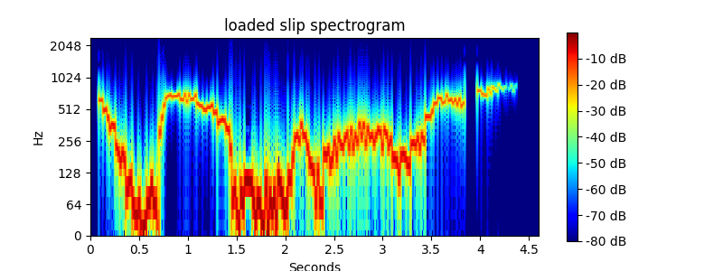

# Spectrosa
Variable frequency range spectrogram using Python `librosa`

Most spectrogram implementations plot from 0 Hz to half sampling rate.  
Frequency range here is controlled by `fmin` and `fmax` values in `spectrosa.py`.  
This Python script was inspired by [Efficiently compute spectrogram for large dataset
 in python](https://www.earthinversion.com/utilities/efficiently-compute-spectrogram-in-python-using-librosa)  

Audio .wav files for rendering to spectrograms can be easily captured from Windows PC sound cards  
using e.g. a trial version of [Renee Audio Recorder Pro](https://www.reneelab.com/audio-recorder-pro),  
then dragging those .wav files to `rosa.bat`, which will require changing, based on install path.  
To avoid changing `rosa.bat`, create a shortcut to it and drag .wav files to the shortcut.  

Evaluating [SimHub ShakeIt tactile effects](https://github.com/SHWotever/SimHub/wiki/ShakeIt-V3-Bass-Shakers---Audio-Output-Configuration) motivated this script.  
  
Discussion of spectrograms for SimHub ShakeIt tactile effects is at [racedepartment.com](https://www.racedepartment.com/threads/simhub-shakeit-bass-shakers-custom-4-corner-tire-slip.198455/page-6).  

[`spectrosa.py`](spectrosa.py) depends on many Python packages;
 here is [a tutorial for Installing Python packages](https://packaging.python.org/tutorials/installing-packages/)  
